<p align="center">
  <picture>
    <source media="(prefers-color-scheme: dark)" srcset="assets/logo-dark.png">
    
  </picture>
</p>

<p align="center">
<b>Explainable 1D-CNN classification of TESS variable stars, with explanations checked against the physics</b>
</p>

<p align="center">


</p>

MantaRay classifies phase-folded TESS 2-minute light curves into **quiet stars, eclipsing binaries,
δ Scuti stars and spotted rotators** with a small 1D convolutional neural network (about 8,000 parameters).
Its main purpose is not accuracy but **trust**: every explanation the network gives (Grad-CAM and
Integrated Gradients) is tested against the physics of the star, with statistics, faithfulness tests and
sanity checks. These tests uncovered a problem that accuracy alone hid, showed how to fix it, and
flagged an error in a large published TESS catalogue.

<p align="center">
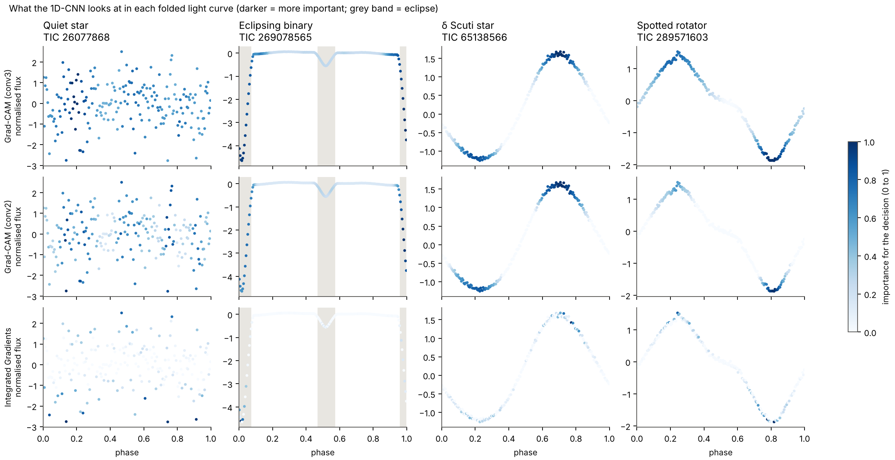
</p>
<p align="center"><i>What the network looks at in four real TESS stars: darker points matter more for the
decision. It focuses on the eclipse edges of the binary and on the light maxima and minima of the
pulsating and rotating stars.</i></p>

---

## Contents

1. [Key results](#key-results)
2. [Figures](#figures)
3. [How it works](#how-it-works)
4. [Installation](#installation)
5. [Running the code](#running-the-code)
6. [Repository layout](#repository-layout)
7. [Data and acknowledgements](#data-and-acknowledgements)
8. [Citation](#citation)

---

## Key results

1,496 vetted TESS stars (374 per class), 5 random training/test splits, mean ± standard deviation.

| Question | Result |
|---|---|
| How accurate is it? | **99.2 ± 0.5%** (1,131 of 1,140 test classifications); 99.9% when it is confident |
| Is it better than classic methods? | **Statistically tied** with a random forest (99.5%) and gradient boosting (99.6%) on the same stars (McNemar p = 0.15) |
| Does it look at the eclipse of a binary? | Integrated Gradients peaks on the eclipse for **100%** of binaries (chance: 22%) |
| Does it look at the pulsation of a δ Scuti star? | Grad-CAM puts **85–86%** of its weight on the light maxima/minima (chance: 52%) |
| Are the explanations faithful? | Yes. Removing the bins the explanation marks lowers the model's confidence much faster than removing random bins (binary: 0.47 vs 0.77) |
| Do the explanations depend on what was learned? | Yes. A network with scrambled weights gives different maps (rank correlation 0.15–0.18) |
| Can it tell when a star is of a type it never saw? | Score 0.91 (1 = perfect); 98% of RR Lyrae and 78% of γ Doradus stars flagged "unknown" |
| What is the faintest signal it catches? | Eclipses about **1.96 mmag** deep, pulsations about **0.63 mmag** (50% recovery, real TESS noise) |
| Do its labels agree with an independent catalogue? | Its predictions agree with Gao et al. (2025) as often as our own catalogue labels do (94.5% vs 94.9%) |

**What the tests found**

1. **A hidden confusion.** Without the period, the network told rotators and δ Scuti stars apart partly
   by how clean the wave was, so weak waves were called "rotator" and strong ones "δ Scuti". Accuracy did
   not show this; the explanation and injection tests did.
2. **The fix, made transparent.** Giving the network the period through a separate, additive term splits
   every decision exactly into *what the shape says* and *what the period says*. Quiet stars and binaries
   are decided by shape; δ Scuti stars and rotators are decided by period, as in their astronomical
   definitions.
3. **A catalogue issue.** 166 stars that are δ Scuti stars by period and colour are labelled γ Cas
   (hot Be stars) in Gao et al. (2025), with low confidence (median 0.34).

---

## Figures

<details open>
<summary><b>Accuracy</b></summary>

**Confusion matrix** (all test stars of the 5 splits). Each row is the true class, each column the
prediction; the diagonal holds the correct answers.

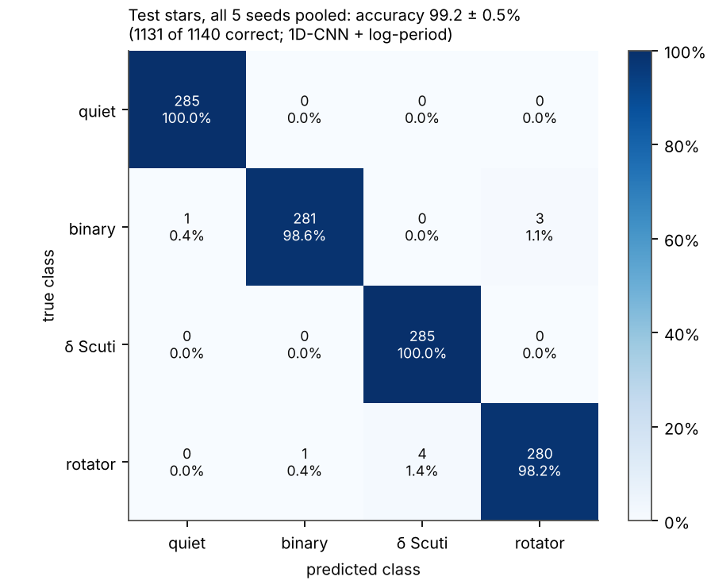

**Fair benchmark.** Every model on the same stars and splits: accuracy and macro-F1 with 95% confidence
intervals, F1 per class, stars never used for training, and accuracy from bright to faint stars.

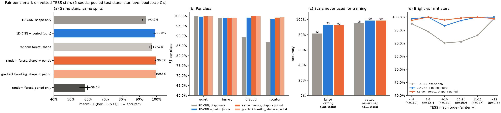

</details>

<details open>
<summary><b>Are the explanations right?</b></summary>

**Explanations against chance.** For every star: is the heat-map peak on the eclipse, and how much of it
lies on the eclipse or on the light maxima/minima? Dot = mean, bar = 95% confidence interval,
grey tick = chance.

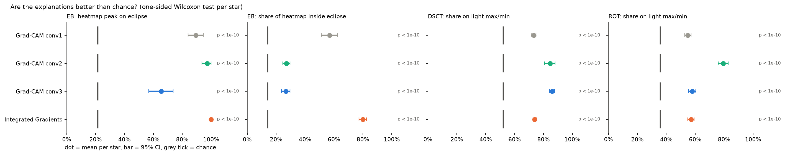

**Deletion test (faithfulness).** The bins each method marks as important are flattened, most important
first. A faithful explanation makes the model's confidence fall faster than random flattening (grey).
Integrated Gradients is the faithful method for eclipses; Grad-CAM for pulsations.

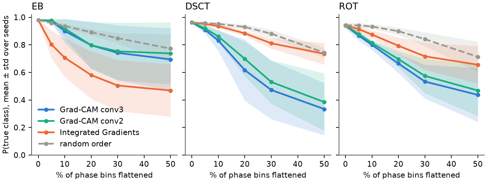

</details>

<details open>
<summary><b>The hidden shortcut and the period fix</b></summary>

**Weak or strong, rotator or δ Scuti?** (a) Sine waves injected into real quiet stars: the shape-only
network calls weak waves "rotator" and strong ones "δ Scuti". (b) With the period as input, the label
follows the period at every strength. (c, d) Real δ Scuti stars and rotators made artificially fainter.
"A: S/N-matched" is a training fix that did *not* work, which shows the problem was missing period
information, not signal strength.

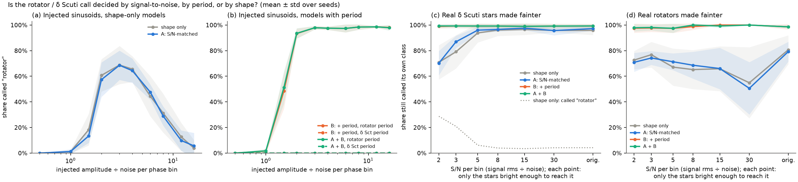

**Shape versus period.** (a) What the network learned from the period alone, with the period range of
each star type. (b) Whether the shape term or the period term would have got each star right on its own.
(c) Conflict test: a star given the period of another class; binaries keep their class, δ Scuti stars
and rotators follow the period.

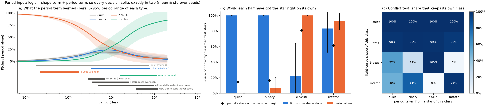

**Can explanations catch a cheating model?** (Synthetic test.) A fake glitch is planted on every δ Scuti
training curve. As the network relies on it more (a), Integrated Gradients points at it up to 25× more
than chance, while a network trained without the glitch does not (b–d).

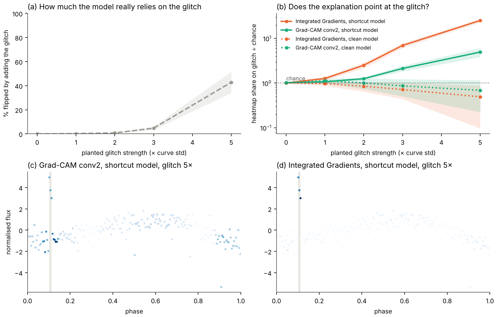

</details>

<details open>
<summary><b>Limits and checks</b></summary>

**Star types it never saw.** γ Doradus, RR Lyrae, ellipsoidal binaries and dip/transit stars: what the
network calls them, and how often its confidence flags them as "unknown".

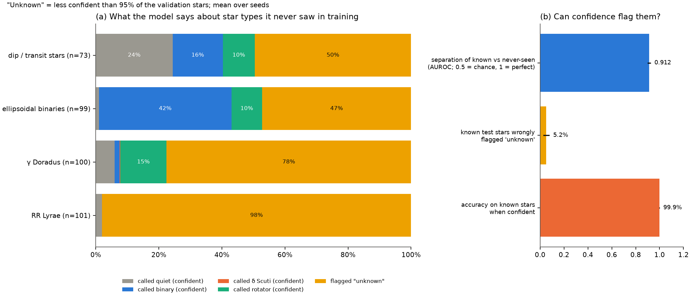

**Detection limit.** Eclipses and pulsations of known size injected into real quiet TESS stars.
The dashed line marks 50% recovery.

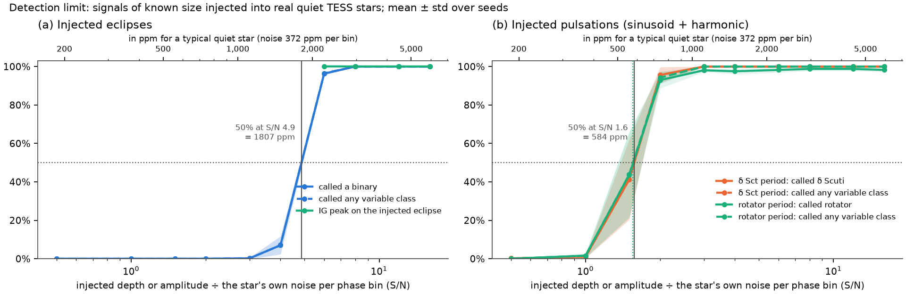

**Every star it got wrong.** Three rotators near the period boundary with δ Scuti stars, three binaries
with starspot waves, and two stars with heavy light contamination from neighbours.

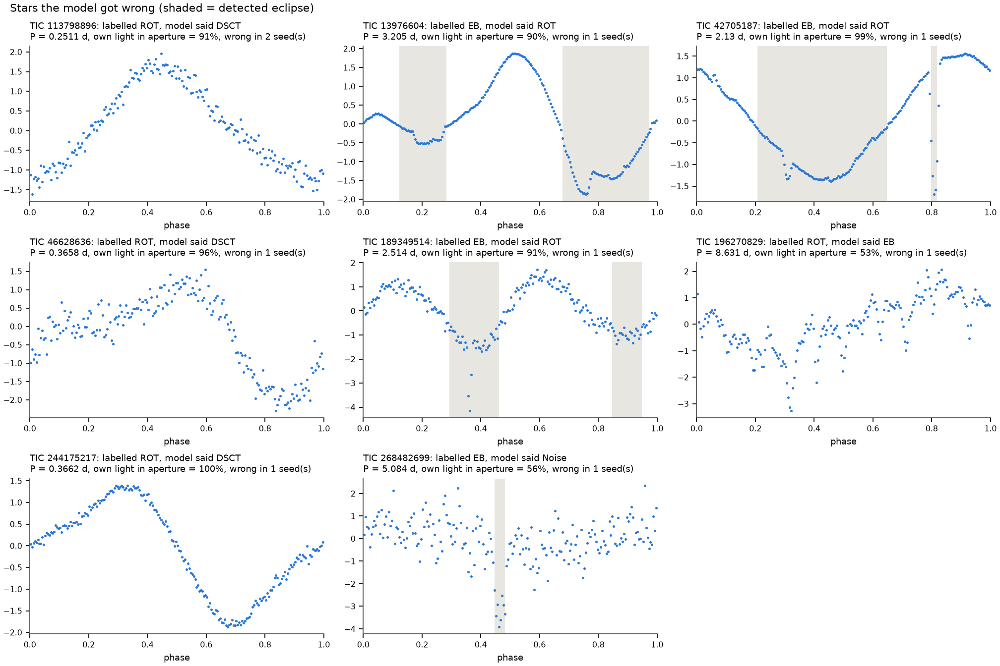

**Outside check against Gao et al. (2025).** Agreement of our labels and predictions with an independent
catalogue of 72,505 TESS variables.

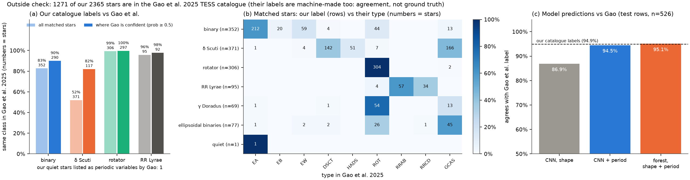

</details>

---

## How it works

```
TESS 2-min light curve ──► clean ──► find period ──► fold into 200 phase bins ──► normalise
                                          │
                                          └────────── log(period) ───────────┐
                                                                             ▼
   folded curve ──► 1D-CNN (3 conv layers, ~8k parameters) ──► shape score ──(+)──► class
                                                               period score ─┘
   explanations: Grad-CAM (conv1, conv2, conv3) and Integrated Gradients on the folded curve
```

1. **Data.** Labels come from the TESS Eclipsing Binary catalogue (binaries) and the AAVSO VSX
   (δ Scuti stars, rotators and four test types). Quiet stars are nearby TESS targets with no
   significant signal; they are folded on random periods so the period cannot reveal them.
2. **Vetting.** Every star is checked for false variability: split-half (dust or one-off glitches),
   odd-even (wrong period) and centroid offset (light from a neighbouring star).
3. **Model.** A three-layer 1D-CNN with circular padding (phase 0.99 sits next to phase 0.01). The
   period enters through a small separate network whose score is *added* to the shape score.
4. **Explanations.** Grad-CAM at each convolutional layer and Integrated Gradients, scored against eclipse
   positions and pulsation extrema, with per-star bootstrap confidence intervals and Wilcoxon tests
   against chance, a deletion test and a model-randomisation sanity check.

---

## Installation

Python 3.10 or newer. Everything runs on a normal laptop CPU; no GPU is needed.

```bash
git clone https://github.com/ReineRiver/MantaRay.git
cd MantaRay
python -m pip install -r requirements.txt
```

---

## Running the code

The processed dataset is included in `data/tess/`, so the analysis scripts run straight away.
Results go to `outputs/`; `python make_figures.py` then copies the main figures into `figures/`.

| Step | Command | What it does | Time* |
|---|---|---|---|
| 1 | `python run_tess.py --vetted` | Final model: training, explanations and all tests on the vetted stars (5 splits) → `outputs/tess_vetted_period/` | ~10 min |
| 2 | `python run_fixes.py` | Shortcut tests and the three candidate fixes → `outputs/fixes_vetted/` | ~7 min |
| 3 | `python benchmark.py` | Fair benchmark and outside catalogue check → `outputs/benchmark/` | ~3 min |
| 4 | `python run_experiment.py` | Synthetic pilot, including the planted-glitch test → `outputs/` | ~10 min |
| 5 | `python make_figures.py` | Copies the main figures into `figures/` | seconds |

\* On a laptop CPU.

**Useful options**

| Option | Effect |
|---|---|
| `--seeds 1` | One split only, for a quick check (all four analysis scripts) |
| `--plots-only` | Redraw the figures from saved results without retraining |
| `run_tess.py --model shape` | Shape-only network (no period input) |
| `run_tess.py --classes Noise,EB,DSCT` | Leave rotators out of training; they become a never-seen type |
| `benchmark.py --gao-only` | Redo only the catalogue comparison |

**Rebuilding the dataset from the TESS archive** (optional; needs an internet connection)

| Step | Command | What it does | Time |
|---|---|---|---|
| 1 | `python build_tess_dataset.py --per-class 500` | Downloads the catalogues and one TESS sector per star, processes and exports the dataset | a few hours |
| 2 | `python vet_tess.py` | Downloads each star again and runs the vetting tests | 2–3 hours |

Both scripts are resumable: stop them at any time and run the same command again to continue.
`--per-class 20` builds a small test dataset in a few minutes. If the Gao et al. (2025) catalogue cannot be
downloaded automatically, save `Table5_TESSVar.txt` from <https://nadc.china-vo.org/res/r101482/> as
`data/external/gao2025_table5.txt`.

---

## Repository layout

| Path | Contents |
|---|---|
| `mantaray/model.py` | The 1D-CNN, its optional additive period term, and training |
| `mantaray/explain.py` | 1D Grad-CAM, Integrated Gradients, deletion test, sanity check, alignment metrics |
| `mantaray/tess.py` | One TESS light curve → one dataset row: cleaning, periodogram, folding, eclipse mask, class checks |
| `mantaray/vetting.py` | Split-half, odd-even and centroid vetting tests |
| `mantaray/data.py` | Synthetic light curves (detached and contact binaries, δ Scuti, quiet stars) and the CSV loader |
| `mantaray/evaluate.py`, `stats.py`, `features.py`, `report.py` | Scoring, statistics, Fourier features for the baselines, figures |
| `run_tess.py`, `run_fixes.py`, `benchmark.py`, `run_experiment.py` | The analyses (see the table above) |
| `build_tess_dataset.py`, `vet_tess.py` | Building and vetting the dataset |
| `data/tess/` | The processed dataset (below) |
| `figures/` | The main result figures shown in this README |

**Dataset files** (`data/tess/`)

| File | Contents |
|---|---|
| `tess_dataset.csv` | One star per row: column 0 = class (0 quiet, 1 binary, 2 δ Scuti, 3 rotator), columns 1–200 = folded, binned flux |
| `tess_meta.csv` | TIC number, TESS sector, period, CROWDSAP, noise level and processing details per row |
| `tess_masks.npy` | Eclipse mask per row (binaries) |
| `tess_vetting.csv` | Vetting results per row |
| `unseen_dataset.csv`, `unseen_meta.csv` | Never-seen test stars: γ Doradus, RR Lyrae, ellipsoidal binaries, dip/transit stars |

---

## Data and acknowledgements

This work uses data collected by the TESS mission, obtained from the Mikulski Archive for Space
Telescopes (MAST, [doi:10.17909/t9-nmc8-f686](https://doi.org/10.17909/t9-nmc8-f686)). Funding for the
TESS mission is provided by NASA's Science Mission Directorate.

It also uses the TESS Eclipsing Binary catalogue (Prša et al. 2022, ApJS 258, 16), the AAVSO
International Variable Star Index (VSX), the VizieR catalogue service (CDS, Strasbourg), the catalogue of
Gao, Chen, Wang & Liu (2025, ApJS 276, 57), and the Python packages
[lightkurve](https://github.com/lightkurve/lightkurve), [astroquery](https://github.com/astropy/astroquery),
[astropy](https://www.astropy.org/), [PyTorch](https://pytorch.org/), NumPy, SciPy, pandas,
scikit-learn and Matplotlib.

---

## AI Acknowledgement

An AI Chatbot (Claude, Anthropic) was used in the creation of the code used in this repository. I designed the study and checked every reported number against the result files. The AI chatbot was an aide to writing the code, not the one who wrote or designed the aspects of the paper, however I take full responsibility for the content.

## Citation

A paper describing this work is in preparation. Until then, please cite this repository.
